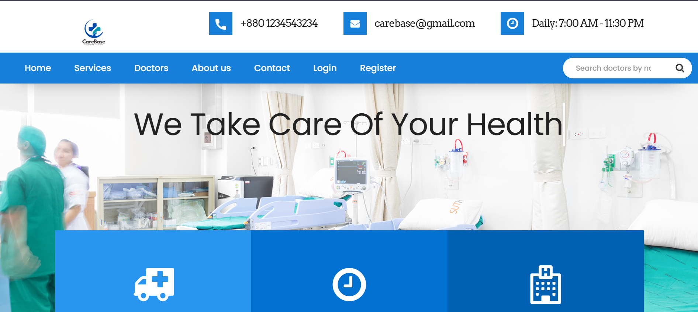
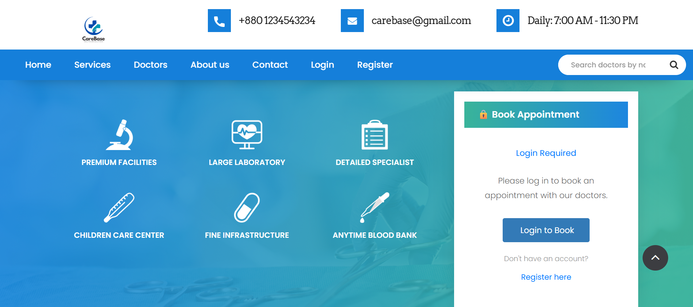
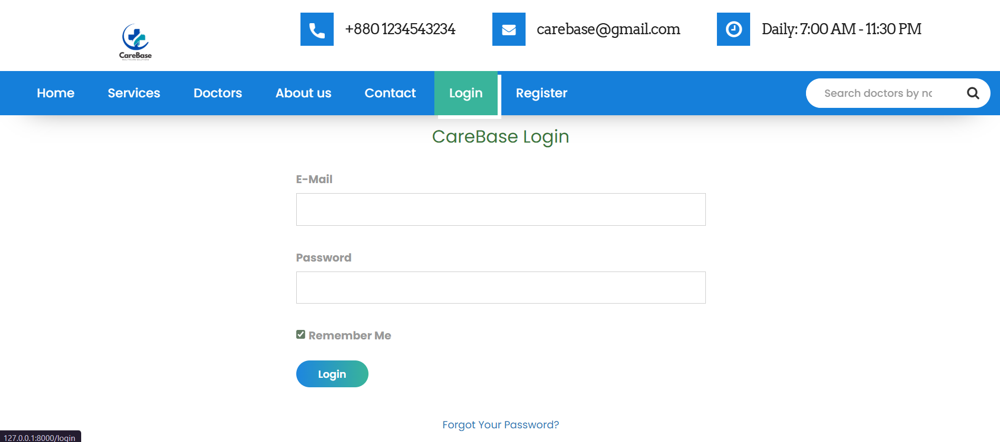
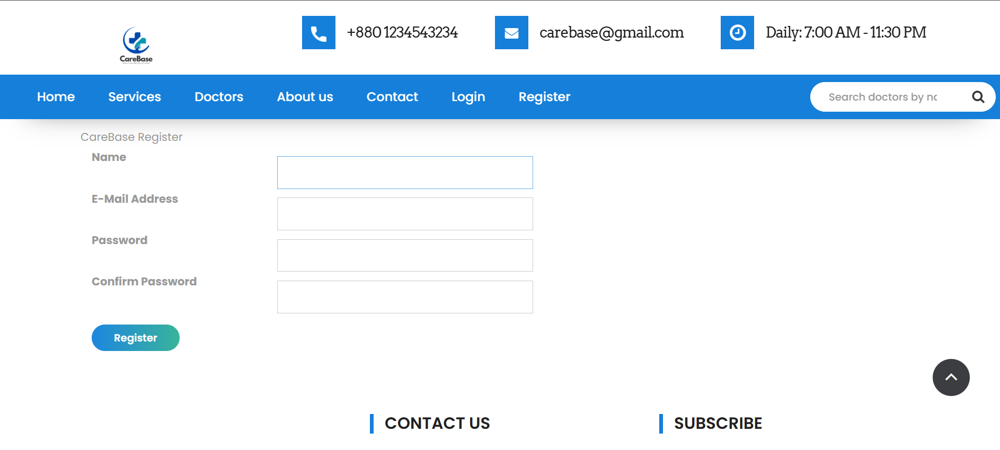
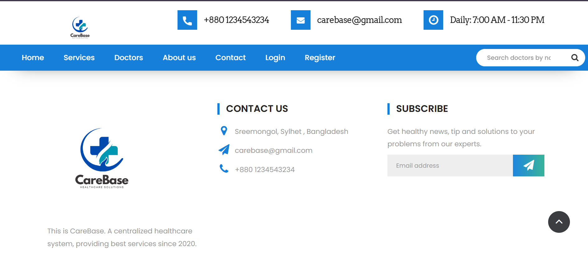
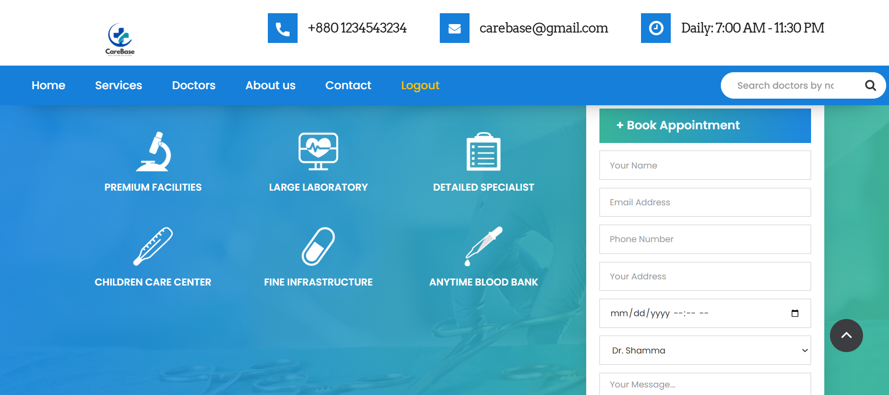

# 🏥 CareBase - Hospital Management System

CareBase is a modern and efficient **Hospital Management System** designed to streamline healthcare operations.  
It combines **healthcare services** with **database management** to offer a smooth, secure, and user-friendly platform for hospitals, clinics, and medical centers.

---

## 🚀 Features

- **User Authentication** – Secure login and registration for patients and staff.
- **Admin Dashboard** – Manage doctors, patients, appointments, and hospital records.
- **Appointment Booking** – Easy booking and scheduling for patients.
- **Contact & Support** – Dedicated contact and inquiry pages.
- **Responsive Design** – Works seamlessly on desktops, tablets, and mobile devices.
- **Modern UI** – Clean and professional interface with easy navigation.

---

## 📸 Website View

### 🔹 Home Page



### 🔹 Login Page


### 🔹 Registration Page


### 🔹 Admin Dashboard


### 🔹 Contact Page


### 🔹 Book Appointment



---

## 🛠️ Tech Stack

- **Frontend:** HTML, CSS, JavaScript, Bootstrap  
- **Backend:** Laravel (PHP Framework)  
- **Database:** MySQL  
- **Version Control:** Git & GitHub

---


## Installation

Follow these instructions to set up and run the project locally on your Machine.

### Prerequisites

- [Git](https://git-scm.com/)
- [Composer](https://getcomposer.org/)
- [PHP](https://www.php.net/)

### Installation

1. Clone the repository:

```bash
   git clone https://github.com/Shamma-Samiha/Hospital-Management-System.git
```
 ```bash
   cd hospitalMS
```

 ```bash
composer install
```
 ```bash
cp .env.example .env
```
```bash
php artisan key:generate
 ```
```bash
php artisan storage:link
```
 ```bash
 php artisan migrate:fresh --seed
```
 ```bash
 php artisan serve
```


## If you like our project (CareBase) please leave a star ❤

